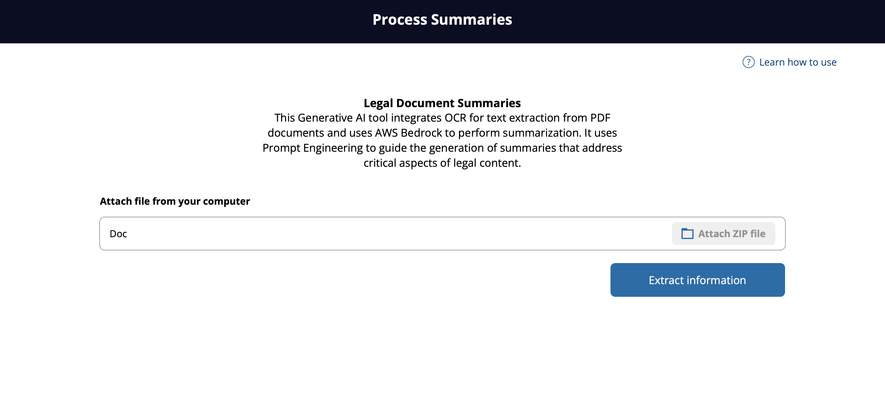

# LEGAL DOCS SUMMARIZER

### **OVERVIEW**

This project utilizes AWS Bedrock and OCR technology to extract text from PDFs, enabling the creation of detailed summaries of legal documents. The summarization leverages prompt engineering, with specific parameters tailored to enhance response accuracy and relevance. The Bedrock API uses the Anthropic Claude-v2 model, configured with a deterministic approach and prioritizing the most probable tokens. The setup focuses on precise output generation, ensuring summaries are coherent and well-structured, guided by advanced AI capabilities from the Claude-v2 model.

## 

---

### **BACKEND ENDPOINT**

| Method | Endpoint                                | Description       |
| ------ | --------------------------------------- | ----------------- |
| POST   | https://localhost:8000/generate_summary | Generate Summmary |

---

### **USEFUL LINKS**

> [!TIP]
> - [AWS Bedrock models ID](https://docs.aws.amazon.com/bedrock/latest/userguide/model-ids.html)
> - [AWS Bedrock prompt for summarization](https://docs.aws.amazon.com/bedrock/latest/userguide/prompt-templates-and-examples.html#summarization)
> - [Anthropic models comparison](https://docs.anthropic.com/en/docs/about-claude/models)
> - [Anthropic chunck summ improve performance](https://docs.anthropic.com/en/docs/about-claude/use-case-guides/legal-summarization#improve-performance)
> - [Anthropic summarization prompt engineering guide](https://github.com/anthropics/anthropic-cookbook/blob/main/skills/summarization/guide.ipynb)

---

### **AUTHOR**

- Giovane Hashinokuti Iwamoto - Computer Science - Brazil

I am always open to receiving constructive criticism and suggestions for improvement in my developed code. I believe that feedback is an essential part of the learning and growth process, and I am eager to learn from others and make my code the best it can be. Whether it's a minor tweak or a major overhaul, I am willing to consider all suggestions and implement the changes that will benefit my code and its users.
